# 🏛️ Architecture Design Document - RESTFUL-API.dev Integration Tests

## 📖 Document Information

| Field | Value |
|-------|-------|
| **Document Version** | 1.0 |
| **Created Date** | 2025-08-06 |
| **Last Updated** | 2025-08-06 |
| **Status** | Active |
| **Architecture Type** | Layered Integration Test Architecture |
| **Target Framework** | .NET 9.0 |

---

## 🎯 Architecture Overview

### 📝 Purpose

This document defines the architectural design and structure of the RESTFUL-API.dev integration test suite, detailing the system components, their relationships, data flow patterns, and deployment architecture.

### 🔍 Scope

**In Scope:**
- Test framework architecture and layering
- Component relationships and interactions
- Data flow patterns and communication protocols
- CI/CD pipeline architecture
- External system integrations
- Testing patterns and design principles

**Out of Scope:**
- Target API implementation details
- Infrastructure provisioning specifics
- Database schema definitions
- Third-party service implementations

### 🎯 Architectural Goals

1. **Maintainability**: Clean separation of concerns with clear layer boundaries
2. **Testability**: Isolated components enabling effective unit and integration testing
3. **Scalability**: Flexible architecture supporting test suite growth
4. **Reliability**: Robust error handling and resource management
5. **Reusability**: Common components and patterns across test scenarios
6. **Observability**: Comprehensive logging and reporting capabilities

---

## 🏗️ System Architecture

### 🔧 High-Level Architecture

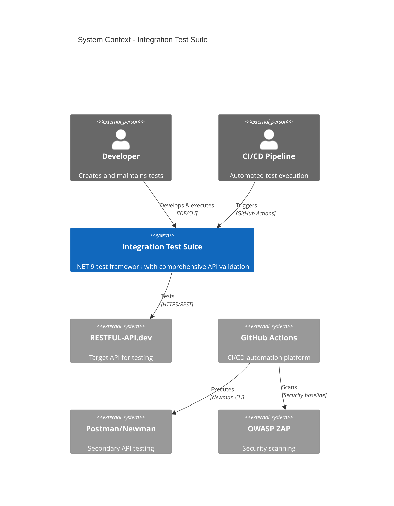

### 🧱 Component Architecture

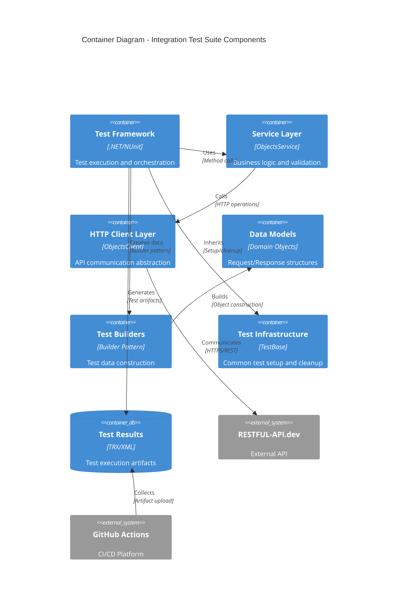

---

## 📚 Layered Architecture

### 🏛️ Architecture Layers

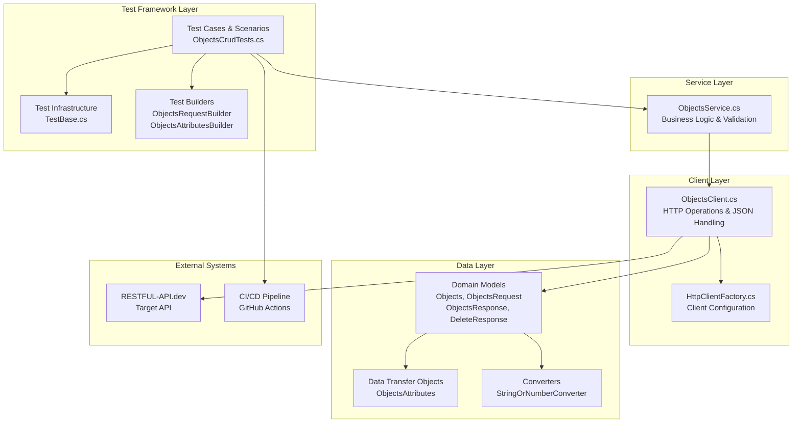

### 📋 Layer Responsibilities

#### **1. Test Framework Layer**
- **Purpose**: Test orchestration, execution, and result validation
- **Components**:
  - `ObjectsCrudTests`: Main test class with all test scenarios
  - `TestBase`: Common setup, cleanup, and utility methods
  - `Test Builders`: Fluent API for test data creation
- **Responsibilities**:
  - Test case implementation and organization
  - Test data setup and teardown
  - Assertion and validation logic
  - Test categorization and filtering

#### **2. Service Layer**  
- **Purpose**: Business logic abstraction and validation
- **Components**:
  - `ObjectsService`: Main service interface for API operations
- **Responsibilities**:
  - Input validation and sanitization
  - Business rule enforcement
  - Error handling and exception translation
  - Operation orchestration

#### **3. Client Layer**
- **Purpose**: HTTP communication and protocol handling
- **Components**:
  - `ObjectsClient`: Generic HTTP client wrapper
  - `HttpClientFactory`: HTTP client configuration and creation
- **Responsibilities**:
  - REST API communication
  - JSON serialization/deserialization
  - HTTP error handling
  - Request/response mapping

#### **4. Data Layer**
- **Purpose**: Data structures and transformation
- **Components**:
  - Domain models (Objects, ObjectsRequest, etc.)
  - Data transfer objects
  - Custom converters and serializers
- **Responsibilities**:
  - Data structure definition
  - Type conversion and validation
  - JSON mapping configuration
  - Data integrity enforcement

---

## 🔄 Component Interactions

### 📊 Sequence Diagram - Test Execution Flow

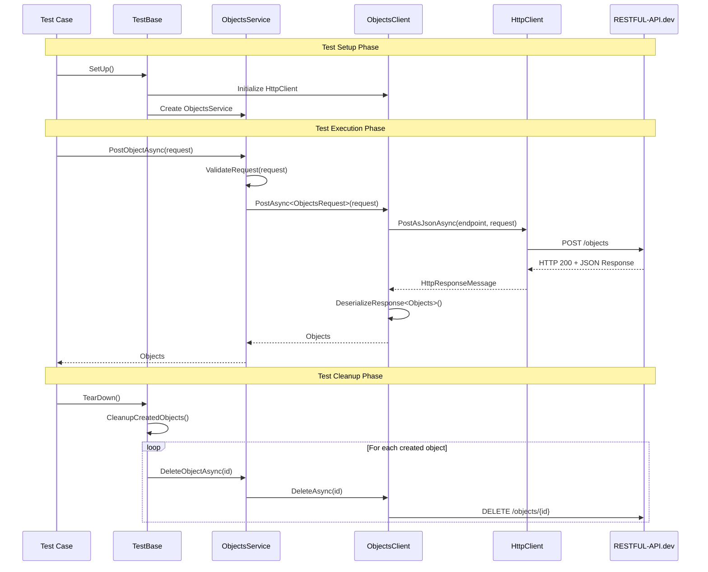

### 🔗 Component Dependencies

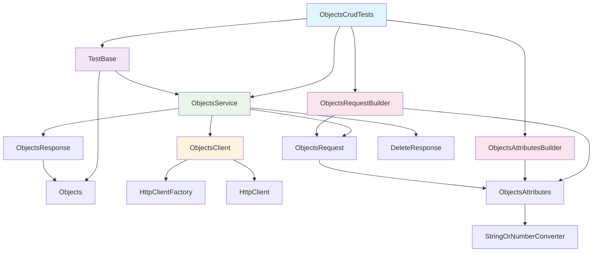

---

## 📋 Design Patterns & Principles

### 🎨 Implemented Design Patterns

#### **1. Builder Pattern**
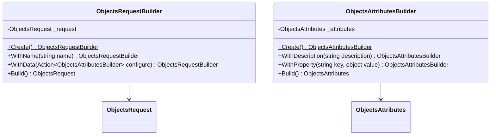

#### **2. Service Layer Pattern**
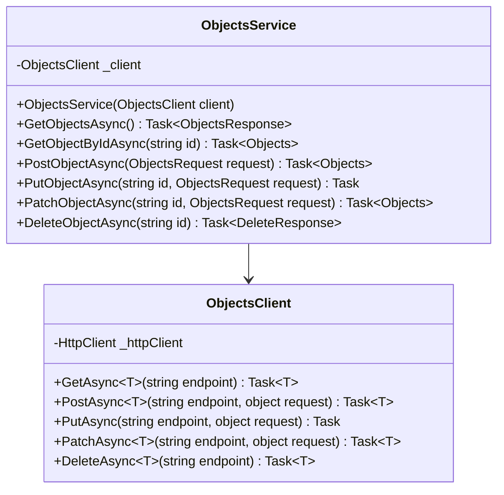

#### **3. Template Method Pattern**
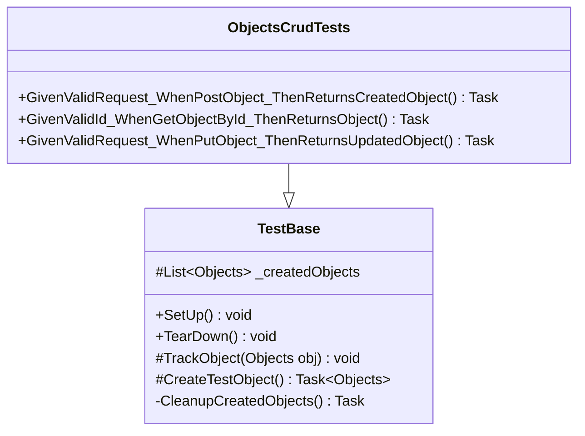

### 📐 SOLID Principles Implementation

#### **Single Responsibility Principle (SRP)**
- **ObjectsService**: Handles only business logic and validation
- **ObjectsClient**: Manages only HTTP communication
- **TestBuilders**: Focus solely on test data construction
- **Models**: Represent only data structures

#### **Open/Closed Principle (OCP)**
- **Builders**: Extensible through method chaining without modification
- **Service Layer**: New operations can be added without changing existing code
- **Test Infrastructure**: New test types can inherit from TestBase

#### **Liskov Substitution Principle (LSP)**
- **HTTP Client**: Uses standard HttpClient interface
- **Models**: Implement proper inheritance hierarchies

#### **Interface Segregation Principle (ISP)**
- **Focused Interfaces**: Each component exposes only necessary methods
- **Minimal Dependencies**: Components depend only on required abstractions

#### **Dependency Inversion Principle (DIP)**
- **Service Layer**: Depends on HttpClient abstraction, not concrete implementation
- **Test Infrastructure**: Uses dependency injection principles

---

## 🗄️ Data Architecture

### 📊 Data Model Structure

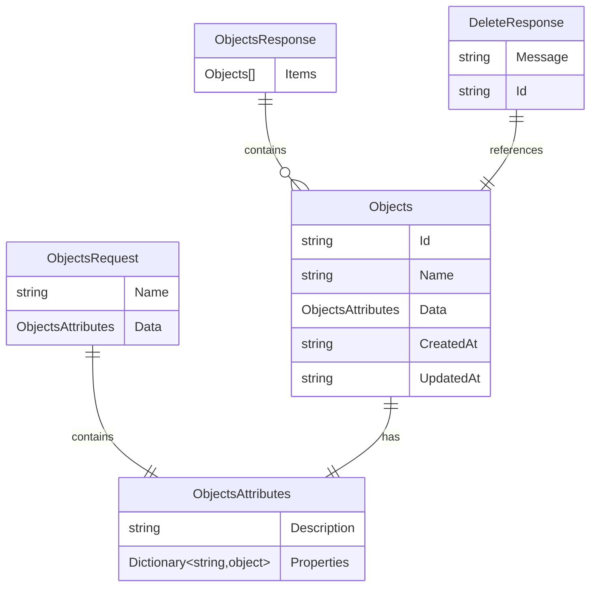

### 🔄 Data Flow Architecture

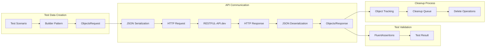

---

## 🚀 Deployment Architecture

### 🌐 CI/CD Pipeline Architecture

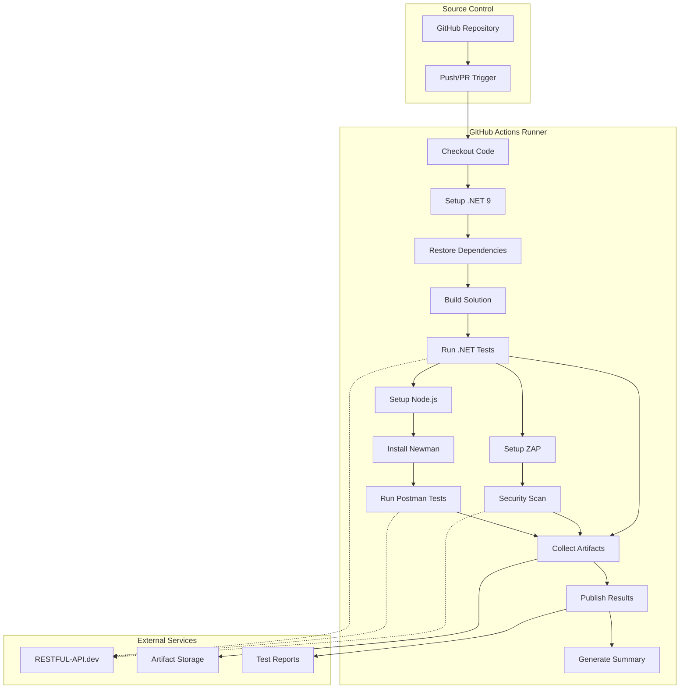

### 📦 Deployment Components

#### **1. Build Environment**
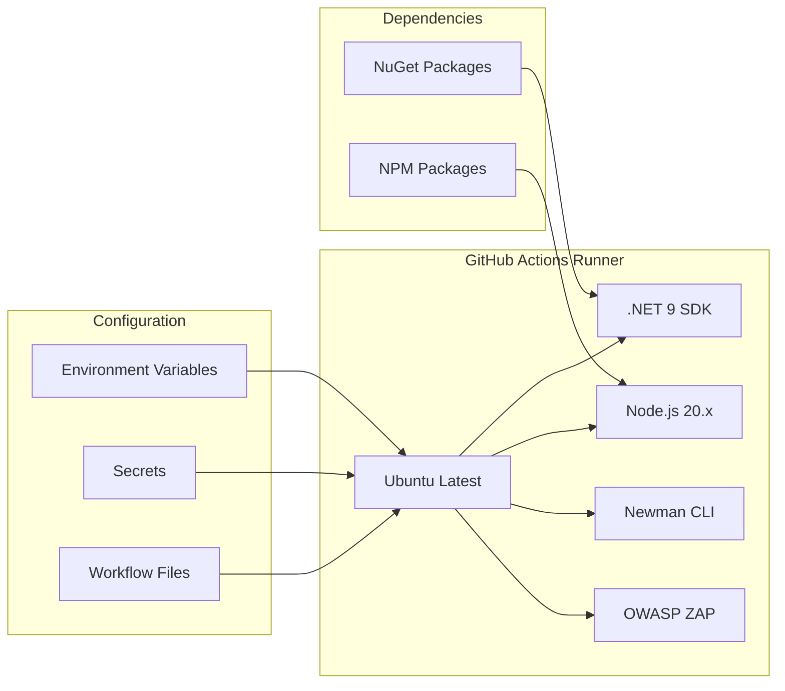

#### **2. Test Execution Environment**
```mermaid
deployment
    node "GitHub Actions Runner" {
        component ".NET Test Process" as dotnet
        component "Newman Process" as newman  
        component "ZAP Process" as zap
        
        database "Test Results" {
            [TRX Files]
            [XML Reports]
            [Security Reports]
        }
    }
    
    cloud "External API" {
        [RESTFUL-API.dev]
    }
    
    dotnet -> [RESTFUL-API.dev] : HTTPS
    newman -> [RESTFUL-API.dev] : HTTPS
    zap -> [RESTFUL-API.dev] : HTTPS
```

---

## 🔒 Security Architecture

### 🛡️ Security Layers

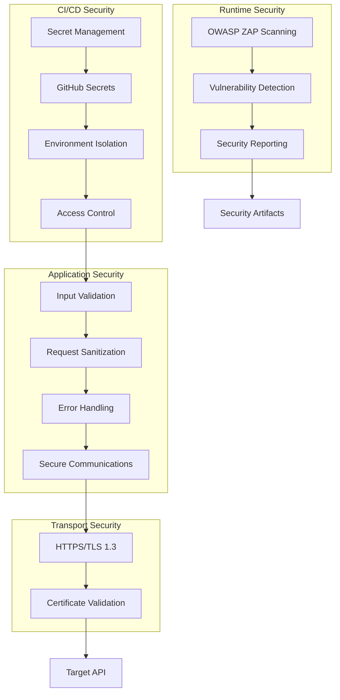

### 🔐 Security Measures

#### **1. Data Protection**
- **In Transit**: All API communications use HTTPS/TLS 1.3
- **Validation**: Input sanitization and validation at service layer
- **Error Handling**: Secure error messages without information disclosure

#### **2. CI/CD Security**
- **Secrets**: GitHub Secrets for sensitive configuration
- **Permissions**: Minimal required permissions for workflow execution
- **Isolation**: Containerized execution environments

#### **3. Security Testing**
- **OWASP ZAP**: Baseline security scanning
- **Dependency Scanning**: Automated vulnerability detection
- **Security Reporting**: Comprehensive security artifact generation

---

## 📊 Performance Architecture

### ⚡ Performance Considerations

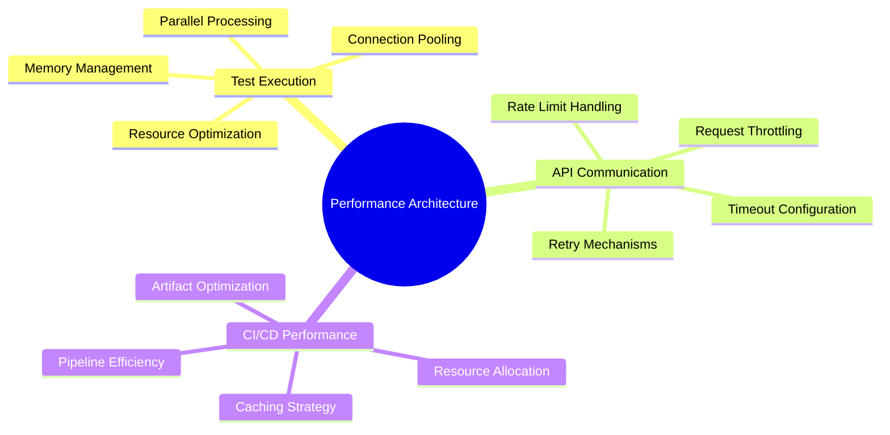

### 📈 Performance Metrics

| Component | Metric | Target | Current |
|-----------|--------|--------|---------|
| **Full Test Suite** | Execution Time | <5 minutes | ~3 minutes |
| **Individual Test** | Response Time | <2 seconds | <1 second |
| **API Requests** | Timeout | 30 seconds | 30 seconds |
| **Cleanup Operations** | Batch Processing | <30 seconds | <15 seconds |
| **CI/CD Pipeline** | Total Duration | <10 minutes | ~8 minutes |

---

## 🔍 Monitoring & Observability

### 📊 Observability Architecture

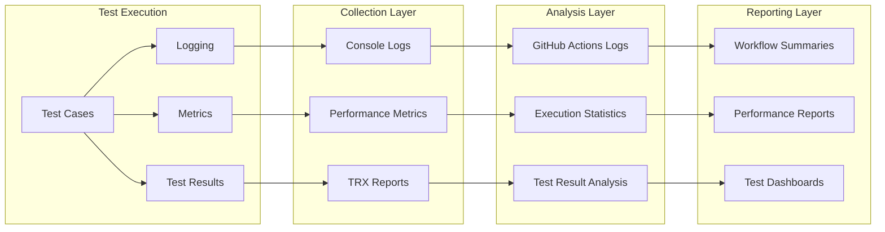

### 📋 Monitoring Components

#### **1. Test Execution Monitoring**
- **Real-time Logging**: Console output with detailed test progress
- **Performance Tracking**: Response time and execution duration metrics
- **Error Tracking**: Comprehensive exception and failure logging

#### **2. CI/CD Monitoring**
- **Pipeline Metrics**: Build duration, success rates, artifact sizes
- **Resource Usage**: Memory, CPU, and network utilization
- **Historical Trends**: Test result patterns and performance evolution

#### **3. API Health Monitoring**
- **Response Times**: API endpoint performance tracking
- **Error Rates**: HTTP error frequency and patterns
- **Availability**: Service uptime and connectivity validation

---

## 🔮 Future Architecture Considerations

### 📈 Scalability Roadmap

#### **Short Term (1-3 months)**
- **Test Parallelization**: Concurrent test execution for improved performance
- **Enhanced Reporting**: Rich dashboards and advanced analytics
- **Contract Testing**: API contract validation and versioning

#### **Medium Term (3-12 months)**  
- **Microservice Testing**: Multi-service integration testing capabilities
- **Performance Testing**: Load and stress testing integration
- **Test Data Management**: Advanced test data generation and management

#### **Long Term (1+ years)**
- **AI-Powered Testing**: Intelligent test generation and optimization
- **Cross-Platform Testing**: Multi-environment and multi-platform support
- **Advanced Analytics**: Predictive analytics and trend analysis

### 🔄 Architecture Evolution

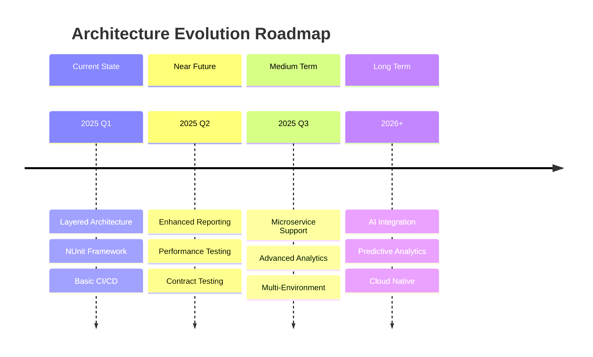

---

## 📝 Conclusion

This architectural design document provides a comprehensive blueprint for the RESTFUL-API.dev integration test suite. The architecture emphasizes:

### 🎯 Key Architectural Strengths

- **Layered Design**: Clear separation of concerns enabling maintainability
- **Pattern Implementation**: Proven design patterns for code quality and reusability
- **Comprehensive Testing**: Full API lifecycle coverage with robust validation
- **CI/CD Integration**: Automated testing with comprehensive reporting
- **Security Focus**: Multi-layered security approach with automated scanning
- **Performance Optimization**: Efficient execution with monitoring capabilities

### 🚀 Architectural Benefits

- **Maintainability**: Modular design supports easy updates and extensions
- **Testability**: Isolated components enable thorough testing at all levels
- **Scalability**: Flexible architecture supports growth and evolution
- **Reliability**: Robust error handling and resource management
- **Observability**: Comprehensive monitoring and reporting capabilities

The architecture successfully balances simplicity with sophistication, providing a solid foundation for comprehensive API integration testing while maintaining the flexibility to evolve with changing requirements.

---

## 📚 References

- [.NET 9 Architecture Guidelines](https://learn.microsoft.com/en-us/dotnet/architecture/)
- [NUnit Testing Framework](https://docs.nunit.org/)
- [GitHub Actions Architecture](https://docs.github.com/en/actions)
- [REST API Testing Best Practices](https://restfulapi.net/rest-api-testing/)
- [Software Architecture Patterns](https://www.oreilly.com/library/view/software-architecture-patterns/9781491971437/)

---

*This document is maintained by the development team and updated regularly to reflect architectural changes and improvements.*